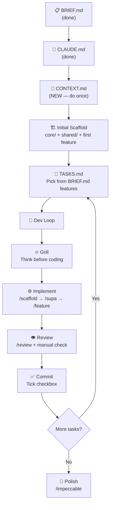

# 🧭 Workflow Decision: Your Skills vs Matt Pocock's Skills

## TL;DR — You don't need to choose. They solve different problems.

| Concern | Your 6 Skills | Matt Pocock's Skills |
|---|---|---|
| **Target** | Flutter Clean Architecture (domain-specific) | Any codebase, TypeScript-heavy (generic) |
| **Core Philosophy** | "Generate correct code fast" — scaffold → implement → review | "Align thinking first" — grill → document → implement |
| **Strength** | Enforces YOUR architecture (Clean Arch, Riverpod, Supabase) | Prevents misalignment & improves code design over time |
| **Weakness** | Assumes you already know what to build | Doesn't know Flutter/Dart/Clean Architecture patterns |

> [!IMPORTANT]
> Matt Pocock's skills are **process skills** (HOW to think). Your skills are **domain skills** (WHAT to generate). They live on different layers and complement each other.

---

## Side-by-Side Mapping

| Your Skill | Matt Pocock Equivalent | Verdict |
|---|---|---|
| `/ask` | `/zoom-out` | Both explore code — keep `/ask` (it knows your architecture) |
| `/scaffold` | — (no equivalent) | **Unique to you** — Matt doesn't scaffold |
| `/feature` | `/tdd` (partial) | Keep `/feature` — TDD is a bonus, not a replacement |
| `/review` | `/improve-codebase-architecture` | Both review code — keep `/review` (knows CLAUDE.md rules) |
| `/supa` | — (no equivalent) | **Unique to you** — Matt has no Supabase skill |
| `/impeccable` | — (no equivalent) | **Unique to you** — external UI/UX skill |
| — | `/grill-me`, `/grill-with-docs` | **Missing from yours** — this is what you should adopt |
| — | `/to-prd`, `/to-issues` | Partially covered by your BRIEF.md + TASKS.md approach |
| — | `/diagnose` | **Worth adopting** for debugging sessions |
| — | `/triage` | Overkill for a 2-3 person team |
| — | `CONTEXT.md` | **Worth adopting** — shared language document |

---

## What Matt Pocock Gets Right (That You're Missing)

### 1. The Grilling Step 🔥
Before coding anything, `/grill-with-docs` forces you to think deeply:
- "What edge cases exist?"
- "How does this interact with existing features?"
- "What's the domain language for this concept?"

**You skip this step entirely.** You go straight from BRIEF → scaffold → code. This means the agent guesses your intent and often gets it wrong.

### 2. CONTEXT.md — Shared Language
Matt's `CONTEXT.md` gives the agent a dictionary of your domain terms. For JobConnect, this means:
- "Application" = ứng đơn ứng tuyển (not a software application)
- "Profile" = hồ sơ ứng viên
- "Match score" = cosine similarity result from pgvector

Without this, the agent wastes tokens explaining obvious things.

### 3. Architecture Hygiene Loop
`/improve-codebase-architecture` runs periodically to catch entropy. Your `/review` checks rule compliance but doesn't suggest structural improvements.

---

## What Matt Pocock Gets Wrong (For Your Project)

1. **No Flutter/Dart awareness** — his skills assume TypeScript, npm, vitest
2. **No Clean Architecture enforcement** — he doesn't care about `data/domain/presentation` layers
3. **No Supabase patterns** — RLS, Edge Functions, Realtime are invisible to him
4. **GitHub Issues as task tracker** — overkill for your 2-3 person đồ án nhóm
5. **TDD in Flutter** — more complex setup than TypeScript; your `/feature` skill already has a specific build order

---

## ✅ Your Final Workflow — Refined

Your 5-step plan is **correct**. Here it is, refined with the best ideas from both worlds:



### Step-by-step:

#### Step 0: BRIEF.md + CLAUDE.md ✅ (Done)

#### Step 1: Create CONTEXT.md (Do Once — 10 minutes)
> [!TIP]
> This is the single most valuable idea from Matt Pocock. Add it.

Create `f:\CODE\LTDD\CONTEXT.md` with your domain vocabulary. Example:

```markdown
# CONTEXT.md — JobConnect Domain Language

## Core Terms
- **Seeker**: Job Seeker (người tìm việc) — tạo profile, apply jobs
- **Recruiter**: Nhà tuyển dụng — post jobs, manage applications  
- **Application**: Đơn ứng tuyển (NOT the software app)
- **Post / Job Post**: Tin tuyển dụng
- **Match Score**: % cosine similarity between profile embedding and job embedding
- **Skill Gap**: Kỹ năng job yêu cầu mà seeker chưa có
- **Saved Search**: Bộ lọc tìm kiếm đã lưu, dùng cho Job Alert
- **Embedding**: vector(768) từ Gemini text-embedding-004

## Architecture Terms  
- **Datasource**: Class gọi Supabase trực tiếp (data layer only)
- **Repository**: Abstract interface ở domain, impl ở data
- **Provider**: Riverpod @riverpod annotation, KHÔNG provider thủ công
- **Entity**: Pure Dart object (domain layer, no json annotation)
- **Model**: Freezed + json_serializable (data layer, maps to/from entity)
```

#### Step 2: Initial Scaffold (Do Once)
Run `/scaffold` for `core/` infrastructure + the first feature (`auth`):

```
You → Agent: "Read BRIEF.md + CLAUDE.md + CONTEXT.md. 
Scaffold the core/ directory (theme, router, errors, constants) 
and the auth feature skeleton."
```

This creates the project skeleton that every other feature depends on.

#### Step 3: Create TASKS.md
Extract features from BRIEF.md §3 into a checklist file. Group by priority:

```markdown
# TASKS.md

## Phase 1 — Auth + Core (tuần 1-2)
- [ ] Email/password registration (chọn role)
- [ ] Email/password login
- [ ] Google OAuth login  
- [ ] Forgot password
- [ ] Logout
- [ ] App theme + router setup

## Phase 2 — Seeker Core (tuần 3-4)
- [ ] Profile CRUD
- [ ] Work experiences CRUD
- [ ] Job search + filter
- [ ] Job detail view
- [ ] Bookmark jobs
- [ ] Apply to job (attach CV)

## Phase 3 — Recruiter (tuần 5)
- [ ] Company profile
- [ ] Post job
- [ ] View applicants
- [ ] Update application status

## Phase 4 — Stand-out Features (tuần 6-7)
- [ ] AI job suggestions (pgvector)
- [ ] Skill gap analysis
- [ ] Chat realtime
- [ ] Push notifications

## Phase 5 — Admin + Polish (tuần 8)
- [ ] Admin dashboard
- [ ] Content moderation
- [ ] UI polish pass
```

#### Step 4: Dev Loop (Repeat Per Task)

For each checkbox in TASKS.md:

| Step | What | How | Time |
|---|---|---|---|
| **4a** | 🔥 **Grill yourself** | Ask the agent: "I want to build [feature]. Ask me 5 questions to clarify edge cases, data flow, and UI expectations." Answer honestly. | 5 min |
| **4b** | 🗄 **DB first** | `/supa schema` → `/supa rls` (if new tables needed) | 5 min |
| **4c** | 🏗 **Scaffold** | `/scaffold [feature]` — creates empty files with correct types | 2 min |
| **4d** | ⚙️ **Implement** | `/feature [feature]` — fills in the logic, layer by layer | 15-30 min |
| **4e** | 👁 **Review** | `/review [feature path]` — check against CLAUDE.md rules | 5 min |
| **4f** | 🔍 **Manual check** | YOU read the generated code. Run `flutter analyze`. Test on device. | 10 min |
| **4g** | ✅ **Commit** | `git add . && git commit -m "feat(feature): description"` | 1 min |
| **4h** | ☑️ **Tick** | Mark checkbox in TASKS.md | 0 min |

> [!WARNING]
> **NEVER skip step 4f (manual review).** The agent will produce plausible-looking code that may have subtle bugs. You are the quality gate.

#### Step 5: Polish Pass (End of Each Phase)
- `/impeccable critique [pages]` — UX review
- `/impeccable craft [pages]` — polish UI
- `/review lib/features/` — final code review
- `flutter analyze` — zero warnings before merge

---

## What NOT to Adopt from Matt Pocock

| Skill | Why Skip |
|---|---|
| `/triage` | You're 2-3 people with a TASKS.md, not managing GitHub issues |
| `/to-issues` | Same — you don't need GitHub issues for a đồ án nhóm |
| `/to-prd` | Your BRIEF.md already IS your PRD |
| `/tdd` | Flutter TDD setup is complex; `/feature` + manual testing is sufficient for your timeline |
| `/caveman` | Token saving trick — not relevant for your workflow |
| `/setup-matt-pocock-skills` | Only works with his specific skill set + GitHub/Linear integration |

---

## Summary — Your Workflow in One Sentence

> **BRIEF.md** (what) → **CLAUDE.md** (rules) → **CONTEXT.md** (language) → **Scaffold** (skeleton) → **TASKS.md** (plan) → **Grill → Implement → Review → Commit** (repeat)

You already had 90% of this figured out. The three things you were missing:
1. **CONTEXT.md** — shared language (adopt from Matt Pocock)
2. **Grill step** — think before generating (adopt the concept, use `/ask` skill)
3. **Confidence** — your workflow is solid. Stop second-guessing it. Start building.
